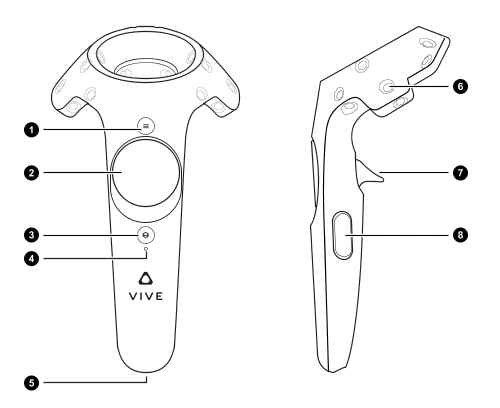

# vive-report (Oculus Report Menu for SteamVR)
This basic mod lets you access the Oculus Report Menu on SteamVR. It does this using your right controller menu button, so it should not have any issues with built-in Gorilla Tag keybinds.

## Why?
Every major mod menu that Gorilla Tag modders use include an "anti-report" that will remove them from the lobby the moment it detects a user pressing the report button over their name. The Oculus report menu bypasses this by placing a leaderboard in front of you so you can report them without their anti-report kicking in.

This has never been avaliable to SteamVR users, and it is super easy to implement in a small mod. This mod provides the same functionality and is completely legal and cannot get you banned.

## Usage
Press your alternate menu button on your controller.

> ### HTC Vive
> 
> For HTC Vive, press the button labelled 3 on the right controller to view the Oculus Report menu.

## Installation
Look for the latest release, and download ``ViveReport.dll``. Drag this into your Plugins folder,launch a game and press your right controller's menu button. The report menu should now show up and work as it would on a Quest.

## Flaws
- **The game will show only a black screen after using the menu in a lobby.** After closing the menu, your world will disappear and you will not be able to see it. It will return to normal once you restart the game.
- ~~Oculus users cannot use the mod.~~ This issue should be fixed with the use of ``ControllerInputPoller`` in the mod.
- **Some mod menus are able to detect Oculus Report**. It is not very popular, but some mod menus have the capability to do it.
